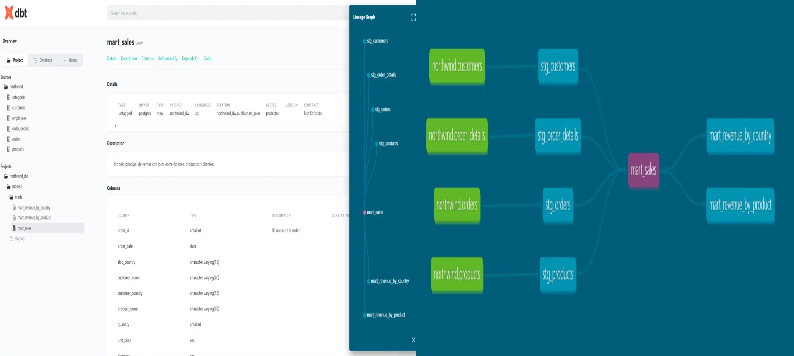
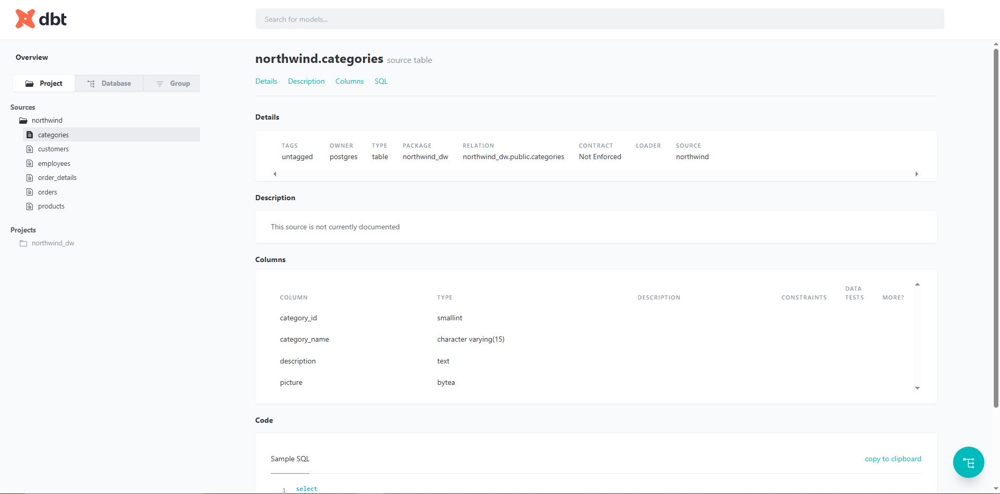
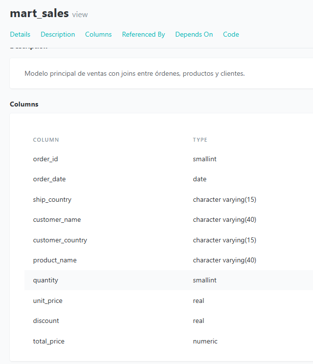
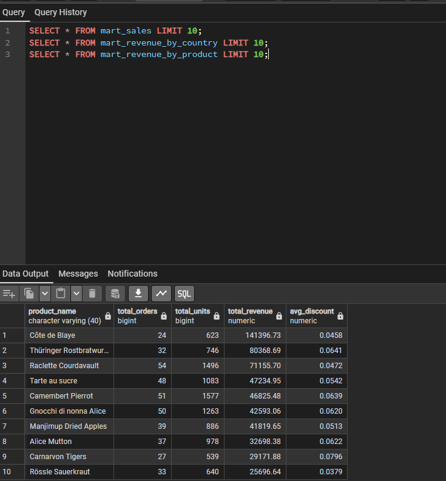

# Data Warehouse con dbt y PostgreSQL

Modelado y transformación de datos con dbt sobre PostgreSQL, estructurando capas de staging y marts orientadas al análisis de negocio. Se implementaron tests de calidad de datos automatizados y documentación del linaje para garantizar trazabilidad y confiabilidad en cada transformación.

---

## Objetivo

Construir un Data Warehouse analítico sobre PostgreSQL usando dbt como herramienta de transformación, aplicando buenas prácticas de modelado dimensional con capas de staging y marts, tests de calidad automatizados y documentación del linaje de datos.

---

## Dataset

Northwind Database — dataset clásico de una empresa distribuidora de productos con información de órdenes, clientes, productos y empleados.  
Fuente: [northwind_psql — GitHub](https://github.com/pthom/northwind_psql)  
Tablas principales: orders, order_details, products, customers, employees, categories

---

## Estructura del repositorio

```
data-warehouse-dbt-postgresql/
│
├── models/
│   ├── staging/
│   │   ├── sources.yml           # Definición de fuentes
│   │   ├── stg_orders.sql        # Staging de órdenes
│   │   ├── stg_order_details.sql # Staging de detalles de órdenes
│   │   ├── stg_products.sql      # Staging de productos
│   │   └── stg_customers.sql     # Staging de clientes
│   │
│   └── marts/
│       ├── schema.yml                    # Tests de calidad
│       ├── mart_sales.sql                # Modelo principal de ventas
│       ├── mart_revenue_by_country.sql   # Ingresos por país
│       └── mart_revenue_by_product.sql   # Ingresos por producto
│
├── images/                       # Capturas del proyecto
├── dbt_project.yml               # Configuración del proyecto dbt
└── README.md
```

---

## Arquitectura del pipeline

```
PostgreSQL (Northwind)
        ↓
Capa Staging (dbt views)
stg_orders · stg_order_details · stg_products · stg_customers
        ↓
Capa Marts (dbt views)
mart_sales · mart_revenue_by_country · mart_revenue_by_product
```

---

## Modelos

### Staging
Capa de estandarización — renombrado de columnas, conversión de tipos y cálculos básicos directamente sobre las tablas fuente.

| Modelo | Descripción |
|---|---|
| stg_orders | Órdenes con fechas convertidas a tipo date |
| stg_order_details | Detalles con cálculo de total_price descontado |
| stg_products | Productos con campos relevantes para análisis |
| stg_customers | Clientes con campos de segmentación geográfica |

### Marts
Capa analítica — joins entre modelos de staging y agregaciones para consumo en herramientas de BI.

| Modelo | Descripción |
|---|---|
| mart_sales | Modelo principal con joins entre órdenes, productos y clientes |
| mart_revenue_by_country | Ingresos totales, pedidos y ticket promedio por país |
| mart_revenue_by_product | Ingresos totales, unidades y descuento promedio por producto |

---

## Tests de calidad

Tests automatizados definidos en `schema.yml`:

| Modelo | Columna | Test |
|---|---|---|
| mart_sales | order_id | not_null |
| mart_sales | product_name | not_null |
| mart_sales | total_price | not_null |
| mart_revenue_by_country | customer_country | not_null, unique |
| mart_revenue_by_product | product_name | not_null, unique |

Resultado: **PASS=7 ERROR=0**

---

## Documentación y linaje

dbt genera documentación automática con el linaje completo del pipeline — desde las tablas fuente hasta los marts finales.



---

## Resultados

### Documentación dbt





### Consultas en PostgreSQL



---

## Ejecución

```bash
# Instalar dbt
pip install dbt-postgres

# Configurar conexión en ~/.dbt/profiles.yml
# Ejecutar modelos
dbt run

# Ejecutar tests
dbt test

# Generar documentación
dbt docs generate
dbt docs serve
```

---

## Stack tecnológico

`dbt` `PostgreSQL` `SQL` `Python` `Git`

---

